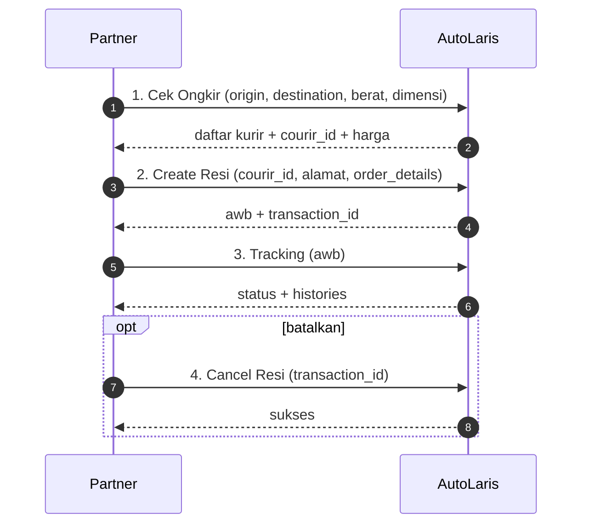

# AutoLaris H2H API — Referensi Lengkap

> Dokumentasi lengkap **AutoLaris H2H API** (Host-to-Host) untuk integrasi partner.
> Sumber: [Postman Documenter](https://documenter.getpostman.com/view/25938923/2sB2iwFuwz).
> Untuk fokus payment gateway, lihat [AutoLaris-Payment-Gateway-API.md](./AutoLaris-Payment-Gateway-API.md).

API H2H AutoLaris adalah layanan untuk mengintegrasikan fitur AutoLaris dengan partner. Terdiri dari 5 service:

| # | Service | Method | Endpoint |
|---|---|---|---|
| 1 | [Cek Ongkir](#1-cek-ongkir) | `POST` | `/api/h2h/ongkir` |
| 2 | [Create Resi](#2-create-resi) | `POST` | `/api/h2h/order` |
| 3 | [Tracking](#3-tracking) | `POST` | `/api/h2h/lacak` |
| 4 | [Cancel Resi](#4-cancel-resi) | `POST` | `/api/h2h/cancel` |
| 5 | [Create Payment](#5-create-payment) | `POST` | `/api/h2h/create_payment` |

---

## Informasi Umum

### Base URL

```
https://api-h2h.autolaris.com
```

> Catatan: pada koleksi Postman beberapa request memakai double-slash (`//api/h2h/...`). URL yang benar adalah single-slash seperti tabel di atas.

### Autentikasi

Seluruh endpoint memakai **Bearer Token** (API Key) di header.

```
Authorization: Bearer <API_KEY>
Content-Type: application/json
```

| Hal | Keterangan |
|---|---|
| Request API Key Production | Dashboard seller → https://seller.autolaris.com (key dikirim ke email terdaftar) |
| Daftar akun | https://seller.autolaris.com/daftar |
| Akses production | Wajib **Whitelist IP Address** (maks. 5 IP) |
| API Key Development | `5fe67ad04a28099fb06b4e185ccf77124a777033913c5525fb49acf59e47b561` (testing saja) |

### Format Response

Semua response memakai pola seragam:

```json
{ "rc": "00", "ket": "Success", "data": { } }
```

| Field | Keterangan |
|---|---|
| `rc` | Response code. `"00"` = sukses; selain itu = gagal |
| `ket` | Keterangan / pesan status |
| `data` | Payload hasil (objek, array, atau `[]` saat kosong) |

> Selalu cek `rc == "00"` sebelum memproses `data`.

### Alur Integrasi Pengiriman



---

## 1. Cek Ongkir

Mengecek tarif & layanan ekspedisi yang tersedia untuk rute dan dimensi tertentu.

| | |
|---|---|
| **Method** | `POST` |
| **URL** | `https://api-h2h.autolaris.com/api/h2h/ongkir` |
| **Auth** | Bearer Token |

### Request Body

```json
{
  "origin": 3515140,
  "destination": 3173060,
  "weight": "1000",
  "length": "10",
  "width": "20",
  "height": "30"
}
```

| Field | Tipe | Wajib | Keterangan |
|---|---|---|---|
| `origin` | number | ✓ | ID area pengirim |
| `destination` | number | ✓ | ID area penerima |
| `weight` | string | ✓ | Berat barang (gram) |
| `length` | string | ✓ | Panjang (cm) |
| `width` | string | ✓ | Lebar (cm) |
| `height` | string | ✓ | Tinggi (cm) |

> 📄 List `origin` & `destination`: [Google Sheet area](https://docs.google.com/spreadsheets/d/130zcs6uHmEtHuPc-WFx0BjlVjo7Ag6WmeUGiYozvRAk/edit?usp=sharing)

### Response — `200 OK`

```json
{
  "rc": "00",
  "ket": "Success",
  "data": [
    {
      "courier_code": "idx",
      "courier_name": "ID Express",
      "service_detail": [
        {
          "courir_id": "6",
          "service": "STD",
          "service_group": "Reguler",
          "service_code": "idx_reguler",
          "duration": "2-3 Hari",
          "etd": "26 Oct - 27 Oct",
          "price": 29000,
          "is_cod": true,
          "is_asuransi": true,
          "is_pickup": true
        }
      ]
    }
  ]
}
```

### Field Response (`data[].service_detail[]`)

| Field | Keterangan |
|---|---|
| `courier_code` / `courier_name` | Kode & nama kurir |
| `courir_id` | **ID layanan** — dipakai di Create Resi (`courir_id`) |
| `service` / `service_group` / `service_code` | Detail nama layanan & grup (Reguler/Cargo/One Day) |
| `duration` / `etd` | Estimasi durasi & tanggal sampai |
| `price` | Tarif (Rp) |
| `is_cod` | `true` = layanan bisa Reguler & COD |
| `is_asuransi` | `true` = melayani asuransi. Nilai asuransi = `insurance` × harga barang |
| `is_pickup` | `true` = mendukung pickup |

> Kurir yang tersedia mencakup: ID Express, SiCepat, J&T Cargo, SPX Express, J&T Express, SAP Express, Ninja Express, JNE Express (bergantung rute).

---

## 2. Create Resi

Membuat order / nomor resi pengiriman (Reguler atau COD).

| | |
|---|---|
| **Method** | `POST` |
| **URL** | `https://api-h2h.autolaris.com/api/h2h/order` |
| **Auth** | Bearer Token |

### Request Body

```json
{
  "reff_id": "123456",
  "courir_id": 18,
  "origin": 3515140,
  "destination": 3173060,
  "weight": "1000",
  "length": "10",
  "width": "20",
  "height": "30",
  "shipper_name": "Toko Joss",
  "shipper_phone": "081331115552",
  "shipper_email": "emailtoko@gmail.com",
  "shipper_address": "alamatnya disini",
  "receiver_name": "Dummy Nama",
  "receiver_phone": "081331000000",
  "receiver_email": "emaildummy@gmail.com",
  "receiver_address": "gang buntu no 5 sidoarjo",
  "callback_url": "",
  "type": 1,
  "grand_total": "12000",
  "cod_value": "19570",
  "longitude": "",
  "latitude": "",
  "remark": "",
  "order_details": [
    { "name": "testing produk", "qty": "2", "unit_price": "2000" },
    { "name": "testing produk kedua", "qty": "1", "unit_price": "8000" }
  ]
}
```

### Parameter Request

| Field | Tipe | Wajib | Keterangan |
|---|---|---|---|
| `reff_id` | string | ✓ | ID referensi/transaksi partner. **Maks 30 digit**. Tidak boleh kirim `reff_id` sama pada hari yang sama |
| `courir_id` | number | ✓ | ID ekspedisi dari response Cek Ongkir |
| `origin` / `destination` | number | ✓ | ID area pengirim / penerima |
| `weight` / `length` / `width` / `height` | string | ✓ | Berat (gram) & dimensi (cm) |
| `shipper_name` / `shipper_phone` / `shipper_email` / `shipper_address` | string | ✓ | Data pengirim |
| `receiver_name` / `receiver_phone` / `receiver_email` / `receiver_address` | string | ✓ | Data penerima |
| `callback_url` | string | — | URL callback untuk update status tracking ekspedisi |
| `type` | number | ✓ | `1` = **REGULER**, `2` = **COD** |
| `grand_total` | string | ✓ | Total harga barang |
| `cod_value` | string | — | Total nominal COD (ditagihkan ke pembeli) |
| `longitude` / `latitude` | string | — | Koordinat (opsional) |
| `remark` | string | — | Catatan |
| `order_details[]` | array | ✓ | List produk: `name`, `qty`, `unit_price` |

### Response — `200 OK`

```json
{
  "rc": "00",
  "ket": "Success",
  "data": {
    "awb": "ALDMY20251023155938",
    "transaction_id": "13518",
    "reff_id": "123456"
  }
}
```

| Field | Keterangan |
|---|---|
| `awb` | **Nomor resi** — dipakai untuk Tracking |
| `transaction_id` | Nomor transaksi AutoLaris — dipakai untuk Cancel Resi. **Wajib disimpan** |
| `reff_id` | ID referensi partner (echo) |

---

## 3. Tracking

Melacak status pengiriman berdasarkan nomor resi.

| | |
|---|---|
| **Method** | `POST` |
| **URL** | `https://api-h2h.autolaris.com/api/h2h/lacak` |
| **Auth** | Bearer Token |

### Request Body

```json
{ "awb": "ALDMY20251023155938" }
```

| Field | Wajib | Keterangan |
|---|---|---|
| `awb` | ✓ | Nomor resi (dari Create Resi) |

### Response — `200 OK`

```json
{
  "rc": "00",
  "ket": "Success",
  "data": {
    "awb": "ALDMY20251023155938",
    "awb_koli": [],
    "awb_sequence": 0,
    "courier_code": "jnt",
    "courier_name": "J&t Express",
    "created": "2025-05-24T10:59:33.531998Z",
    "delivered_date": "2025-05-26",
    "desc": "Paket telah diterima",
    "driver_name": "",
    "driver_phone": "",
    "etd": "26 May - 30 May",
    "histories": [
      {
        "desc": "Manifes",
        "code": "101",
        "date": "2025-05-24",
        "time": "10:59",
        "image": "",
        "driver_name": "",
        "driver_phone": ""
      },
      {
        "desc": "Paket telah diterima",
        "code": "200",
        "date": "2025-05-26",
        "time": "12:04",
        "image": "https://general.jntexpress.id/api/picUrl/create?url=...",
        "driver_name": "",
        "driver_phone": ""
      }
    ],
    "pod_image": "https://general.jntexpress.id/api/picUrl/create?url=...",
    "pod_receiver": "Mbak Fitri",
    "recipient_district": "DUMMY DISTRIK",
    "recipient_name": "DUMMY NAME",
    "recipient_regency": "DUMMY CITY",
    "ref_awb": "",
    "service": "EZ",
    "shipper_district": "DUMMY SENDER DISTRIK",
    "shipper_name": "DUMMY SENDER NAME",
    "shipper_regency": "DUMMY SENDER REGENCY",
    "stats": "DELIVERED"
  }
}
```

### Field Response (utama)

| Field | Keterangan |
|---|---|
| `awb` / `ref_awb` | Nomor resi & referensi |
| `courier_code` / `courier_name` / `service` | Kurir & layanan |
| `created` | Waktu pembuatan resi (ISO 8601) |
| `etd` / `delivered_date` | Estimasi & tanggal terkirim |
| `desc` | Deskripsi status terkini |
| `stats` | Status ringkas (mis. `DELIVERED`) |
| `histories[]` | Riwayat perjalanan: `desc`, `code`, `date`, `time`, `image`, `driver_name`, `driver_phone` |
| `pod_image` / `pod_receiver` | Bukti terima (foto) & nama penerima |
| `recipient_*` / `shipper_*` | Data penerima & pengirim (district/regency/name) |
| `driver_name` / `driver_phone` | Kurir pengantar (terisi saat out for delivery) |

#### Kode status `histories[].code`

| Code | Arti (umum) |
|---|---|
| `101` | Manifest dibuat |
| `100` | Dalam proses (transit antar-gateway/hub) |
| `200` | Paket telah diterima (selesai) |

---

## 4. Cancel Resi

Membatalkan resi yang sudah dibuat.

| | |
|---|---|
| **Method** | `POST` |
| **URL** | `https://api-h2h.autolaris.com/api/h2h/cancel` |
| **Auth** | Bearer Token |

### Request Body

```json
{ "transaction_id": "257918" }
```

| Field | Wajib | Keterangan |
|---|---|---|
| `transaction_id` | ✓ | Nomor transaksi dari response Create Resi |

### Response — `200 OK`

```json
{ "rc": "00", "ket": "Success", "data": [] }
```

---

## 5. Create Payment

Membuat tagihan pembayaran (Virtual Account / QRIS / E-Wallet). **Detail lengkap** (callback, handler, error-handling, go-live) ada di [AutoLaris-Payment-Gateway-API.md](./AutoLaris-Payment-Gateway-API.md).

| | |
|---|---|
| **Method** | `POST` |
| **URL** | `https://api-h2h.autolaris.com/api/h2h/create_payment` |
| **Auth** | Bearer Token |

### Request Body

```json
{
  "reff_id": "2023022514112",
  "channel_code": "VAMANDIRI",
  "customer_id": "31857118",
  "customer_name": "testing name",
  "customer_phone": "081234567890",
  "customer_email": "emailpartner@gmail.com",
  "expired": "20270422094000",
  "amount": "11000",
  "callback_url": "https://url_callback_partner.com/callback"
}
```

| Field | Wajib | Keterangan |
|---|---|---|
| `reff_id` | ✓ | ID referensi/transaksi partner |
| `channel_code` | ✓ | Kode channel (lihat tabel di bawah) |
| `customer_id` / `customer_name` / `customer_phone` / `customer_email` | ✓ | Data pelanggan |
| `expired` | ✓ | Kedaluwarsa tagihan, format `YYYYMMDDHHMMSS` |
| `amount` | ✓ | Nominal pokok (admin ditambahkan terpisah) |
| `callback_url` | ✓ | URL partner untuk notifikasi status pembayaran |

#### Channel Code

| Kode | Keterangan |
|---|---|
| `QRIS` | QRIS |
| `VABCA` | BCA Virtual Account |
| `VAMANDIRI` | Mandiri Virtual Account |
| `VABNI` | BNI Virtual Account |
| `VABRI` | BRI Virtual Account |
| `VABSI` | BSI Virtual Account |
| `VAPERMATA` | Permata Virtual Account |
| `DANA` | E-Wallet DANA |

### Response — `200 OK`

```json
{
  "rc": "00",
  "ket": "Sukses",
  "data": {
    "trx_id": "671647",
    "virtual_account": "8779611150001393",
    "qr": "",
    "payment_code": "",
    "url": "",
    "amount": 11000,
    "admin": 3000,
    "total": 14000
  }
}
```

| Field | Keterangan |
|---|---|
| `trx_id` | ID transaksi pembayaran AutoLaris (simpan untuk callback) |
| `virtual_account` | Nomor VA (channel `VA*`) |
| `qr` | Payload QRIS (channel `QRIS`) |
| `url` / `payment_code` | URL/kode bayar (channel `DANA`) |
| `amount` / `admin` / `total` | Pokok / biaya admin / total tagihan (`amount`+`admin`) |

> Tagihkan **`total`** ke pelanggan. Untuk callback, handler, dan checklist go-live → [dokumentasi payment lengkap](./AutoLaris-Payment-Gateway-API.md).

---

## Contoh Implementasi

### Node.js — client reusable (semua endpoint)

```js
// autolaris.js
const BASE = "https://api-h2h.autolaris.com";

async function call(path, body) {
  const res = await fetch(BASE + path, {
    method: "POST",
    headers: {
      Authorization: `Bearer ${process.env.AUTOLARIS_API_KEY}`,
      "Content-Type": "application/json",
    },
    body: JSON.stringify(body),
  });
  const json = await res.json();
  if (json.rc !== "00") throw new Error(`[${json.rc}] ${json.ket}`);
  return json.data;
}

export const AutoLaris = {
  cekOngkir: (p) => call("/api/h2h/ongkir", p),
  createResi: (p) => call("/api/h2h/order", p),
  tracking: (awb) => call("/api/h2h/lacak", { awb }),
  cancelResi: (transaction_id) => call("/api/h2h/cancel", { transaction_id }),
  createPayment: (p) => call("/api/h2h/create_payment", p),
};
```

```js
// contoh pemakaian
import { AutoLaris } from "./autolaris.js";

// 1) cek ongkir → ambil courir_id termurah
const couriers = await AutoLaris.cekOngkir({
  origin: 3515140, destination: 3173060,
  weight: "1000", length: "10", width: "20", height: "30",
});
const services = couriers.flatMap((c) => c.service_detail);
const cheapest = services.sort((a, b) => a.price - b.price)[0];

// 2) buat resi
const resi = await AutoLaris.createResi({
  reff_id: "ORD-" + Date.now(),
  courir_id: Number(cheapest.courir_id),
  origin: 3515140, destination: 3173060,
  weight: "1000", length: "10", width: "20", height: "30",
  shipper_name: "Toko Joss", shipper_phone: "081331115552",
  shipper_email: "toko@example.com", shipper_address: "Jl. Contoh 1",
  receiver_name: "Budi", receiver_phone: "081331000000",
  receiver_email: "budi@example.com", receiver_address: "Gang Buntu 5, Sidoarjo",
  type: 1, grand_total: "12000", callback_url: "https://you.com/tracking-cb",
  order_details: [{ name: "Produk A", qty: "1", unit_price: "12000" }],
});
console.log("AWB:", resi.awb, "TRX:", resi.transaction_id);

// 3) lacak
const track = await AutoLaris.tracking(resi.awb);
console.log("Status:", track.stats);

// 4) (opsional) batalkan
// await AutoLaris.cancelResi(resi.transaction_id);

// 5) buat tagihan pembayaran
const pay = await AutoLaris.createPayment({
  reff_id: "PAY-" + Date.now(), channel_code: "QRIS",
  customer_id: "C1", customer_name: "Budi", customer_phone: "081234567890",
  customer_email: "budi@example.com", expired: "20270422094000",
  amount: "25000", callback_url: "https://you.com/payment-cb",
});
console.log("Bayar total:", pay.total);
```

### PHP — helper sederhana

```php
function autolaris(string $path, array $body): array {
    $ch = curl_init("https://api-h2h.autolaris.com" . $path);
    curl_setopt_array($ch, [
        CURLOPT_RETURNTRANSFER => true,
        CURLOPT_POST           => true,
        CURLOPT_HTTPHEADER     => [
            "Authorization: Bearer " . getenv("AUTOLARIS_API_KEY"),
            "Content-Type: application/json",
        ],
        CURLOPT_POSTFIELDS => json_encode($body),
    ]);
    $res = json_decode(curl_exec($ch), true);
    curl_close($ch);
    if (($res['rc'] ?? '') !== '00') {
        throw new RuntimeException("[{$res['rc']}] {$res['ket']}");
    }
    return $res['data'];
}

// contoh: cek ongkir
$ongkir  = autolaris('/api/h2h/ongkir', [
    'origin' => 3515140, 'destination' => 3173060,
    'weight' => '1000', 'length' => '10', 'width' => '20', 'height' => '30',
]);

// contoh: buat pembayaran
$payment = autolaris('/api/h2h/create_payment', [
    'reff_id' => 'PAY-' . time(), 'channel_code' => 'VABCA',
    'customer_id' => 'C1', 'customer_name' => 'Budi',
    'customer_phone' => '081234567890', 'customer_email' => 'budi@example.com',
    'expired' => '20270422094000', 'amount' => '25000',
    'callback_url' => 'https://you.com/payment-cb',
]);
```

---

## Ringkasan Response Code

| `rc` | Arti |
|---|---|
| `00` | Sukses |
| selain `00` | Gagal — baca `ket` |

## Catatan Penting

- 🔑 Simpan API Key production sebagai secret; whitelist IP (maks 5) untuk akses production.
- 🆔 `reff_id` sebaiknya unik; **tidak boleh** sama pada hari yang sama (Create Resi).
- 💾 Simpan `transaction_id` (Create Resi) untuk Cancel, dan `awb` untuk Tracking.
- 🔔 Sediakan `callback_url` yang stabil (HTTPS, balas `200`, idempotent) untuk tracking & payment.
- ⏱️ Konfirmasikan zona waktu (`expired`, `created`) ke tim AutoLaris sebelum produksi.

---

_Disusun dari Postman Documenter AutoLaris H2H API. Bukan dokumentasi resmi._
