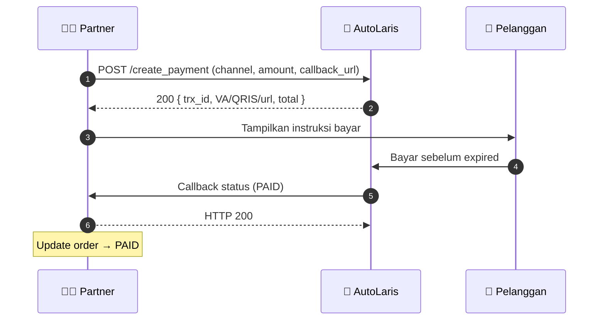

<div align="center">

# 💳 AutoLaris Payment Gateway

### Dokumentasi API **Create Payment** — Virtual Account · QRIS · E-Wallet DANA

Panduan integrasi partner untuk membuat tagihan pembayaran lewat **AutoLaris H2H API**, lengkap dengan alur callback, contoh kode, dan checklist go-live.

<br/>


</div>

---

> [!NOTE]
> Dokumentasi komunitas yang disusun dari [Postman Documenter AutoLaris H2H API](https://documenter.getpostman.com/view/25938923/2sB2iwFuwz) untuk memudahkan integrasi partner. **Bukan** dokumentasi resmi AutoLaris.

## 📑 Daftar Isi

- [Sekilas](#-sekilas)
- [Alur Pembayaran](#-alur-pembayaran)
- [Quick Start](#-quick-start)
- [Channel Pembayaran](#-channel-pembayaran)
- [Response](#-response)
- [Dokumentasi Lengkap](#-dokumentasi-lengkap)
- [Sumber & Lisensi](#-sumber--lisensi)

## ✨ Sekilas

| | |
|---|---|
| 🌐 **Base URL** | `https://api-h2h.autolaris.com` |
| 📮 **Endpoint** | `POST /api/h2h/create_payment` |
| 🔑 **Auth** | `Authorization: Bearer <API_KEY>` |
| 📦 **Content-Type** | `application/json` |
| 🧾 **Channel** | QRIS · 6 Virtual Account · DANA |

## 🔄 Alur Pembayaran



## 🚀 Quick Start

```bash
curl -X POST "https://api-h2h.autolaris.com/api/h2h/create_payment" \
  -H "Authorization: Bearer <API_KEY>" \
  -H "Content-Type: application/json" \
  -d '{
    "reff_id": "ORD-001",
    "channel_code": "VAMANDIRI",
    "customer_id": "31857118",
    "customer_name": "Budi Santoso",
    "customer_phone": "081234567890",
    "customer_email": "customer@example.com",
    "expired": "20270422094000",
    "amount": "25000",
    "callback_url": "https://your-domain.com/autolaris/callback"
  }'
```

<details>
<summary><b>Node.js (fetch)</b></summary>

```js
const res = await fetch("https://api-h2h.autolaris.com/api/h2h/create_payment", {
  method: "POST",
  headers: {
    Authorization: `Bearer ${process.env.AUTOLARIS_API_KEY}`,
    "Content-Type": "application/json",
  },
  body: JSON.stringify({
    reff_id: "ORD-001",
    channel_code: "QRIS",
    customer_id: "31857118",
    customer_name: "Budi Santoso",
    customer_phone: "081234567890",
    customer_email: "customer@example.com",
    expired: "20270422094000",
    amount: "25000",
    callback_url: "https://your-domain.com/autolaris/callback",
  }),
});
const json = await res.json();
if (json.rc !== "00") throw new Error(json.ket);
const { trx_id, virtual_account, qr, url, total } = json.data;
```

</details>

## 🏦 Channel Pembayaran

| Kode | Channel | Tipe |
|---|---|:---:|
| `QRIS` | QRIS | 📱 QR |
| `VABCA` | BCA Virtual Account | 🏦 VA |
| `VAMANDIRI` | Mandiri Virtual Account | 🏦 VA |
| `VABNI` | BNI Virtual Account | 🏦 VA |
| `VABRI` | BRI Virtual Account | 🏦 VA |
| `VABSI` | BSI Virtual Account | 🏦 VA |
| `VAPERMATA` | Permata Virtual Account | 🏦 VA |
| `DANA` | E-Wallet DANA | 👛 E-Wallet |

> 💡 Field instruksi bayar pada response menyesuaikan channel: `VA*` → `virtual_account`, `QRIS` → `qr`, `DANA` → `url`.

## 📥 Response

```json
{
  "rc": "00",
  "ket": "Sukses",
  "data": {
    "trx_id": "671647",
    "virtual_account": "8779611150001393",
    "qr": "",
    "payment_code": "",
    "url": "",
    "amount": 25000,
    "admin": 3000,
    "total": 28000
  }
}
```

> [!IMPORTANT]
> Tagihkan **`total`** (sudah termasuk `admin`) ke pelanggan, dan selalu cek **`rc == "00"`** sebelum memproses `data`.

## 📚 Dokumentasi Lengkap

👉 **[AutoLaris-Payment-Gateway-API.md](./AutoLaris-Payment-Gateway-API.md)**

<table>
<tr><td>

- 🌐 Base URL & environment
- 🔑 Autentikasi & whitelist IP
- 📮 Endpoint `create_payment` (request/response detail)
- 🏦 8 channel pembayaran

</td><td>

- 🔔 Callback + handler **Node.js** & **PHP/Laravel**
- ⚠️ Penanganan error & anti double-charge
- ✅ Checklist go-live
- ❓ Pertanyaan terbuka untuk tim AutoLaris

</td></tr>
</table>

## 🔗 Sumber & Lisensi

- 🏪 Dashboard seller / request API Key → https://seller.autolaris.com
- 📝 Daftar akun → https://seller.autolaris.com/daftar

> Dokumentasi untuk tujuan integrasi. Seluruh merek dagang milik **AutoLaris**. Konfirmasikan detail final (format payload callback, zona waktu `expired`, signature) ke tim AutoLaris sebelum produksi.

<div align="center"><sub>Dibuat untuk mempermudah developer Indonesia 🇮🇩 mengintegrasikan AutoLaris Payment Gateway.</sub></div>
